# Projects
---

### MEDICAL RISK CLASSIFICATION USING REINFORCEMENT LEARNING & COSTLY FEATURES

<!-- 
 -->

**Business Case:**Medical risk classification is cumbersome and the journey is even more difficult for the policy buyer as the number of questions asked can range from 250 - 500. The underwriters are humans adding baises and intuitions thus making different choices on similar policies.

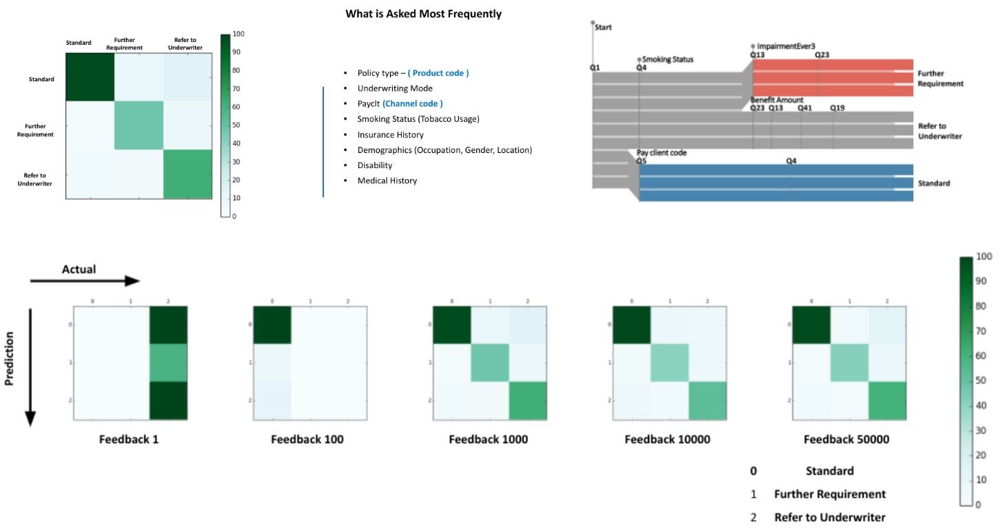

**Solution:** Underwriting automation with a `Deep reinforcement learning agent` reducing <u>the number of questions to 50</u>. The solution brings the first implementation of the artificial brain taking a crucial decision, with a self-learning Insurance Underwriting engine using a Double DQN algorithm.

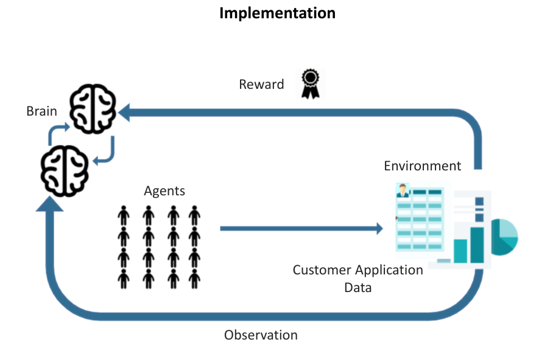

**Training & Deployment Process :**
Identified & extracted training data from SQL database using <b>Apache Flink</b> via JDBC and trained the engine with 1 million+ data points on AWS(EC2) & exposed it as a service (using Flask microservices) <b>achieving 91% accuracy of classification</b> with 50 questions asked at max.

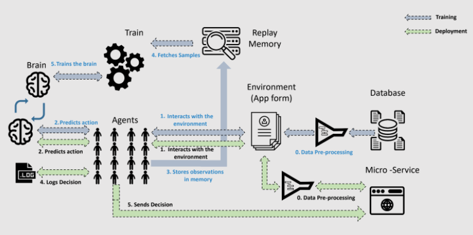

**DRL: Double Deep Q-learning**
The training environment was formalized as per <b>Markov's Decision process (MDP)</b>. In this setting, the `DDQN algorithm has to classify a sample`, but can only reveal its features at a defined cost. Each sample is treated independently, and for each sample, the algorithm sequentially selects features conditioning on values already revealed. Inherently, a different subset of features can be selected for different samples.

Each sample corresponds to an episode, where an agent sequentially decides whether to acquire another feature and which, or whether to already classify the sample. At each step, the agent can base its decision on the values of the features acquired so far. For the actions requesting a feature, the agent receives a negative reward, equal to the feature cost. For the classification actions, the reward is based on whether the prediction is correct.

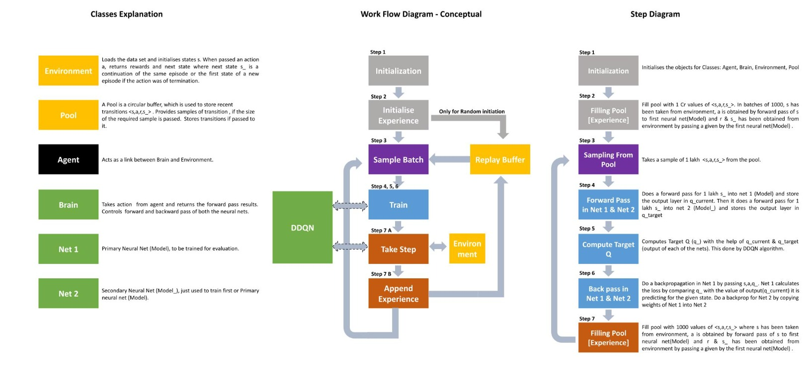

 

---
## Natural Language Processing

### REDUCTION IN CUSTOMER DROPOUTS USING LDA TOPIC MODELLING

<!-- My complete implementation of assignments and projects in [***CS224n: Natural Language Processing with Deep Learning***](http://web.stanford.edu/class/cs224n/) by Stanford (Winter, 2019).

 -->

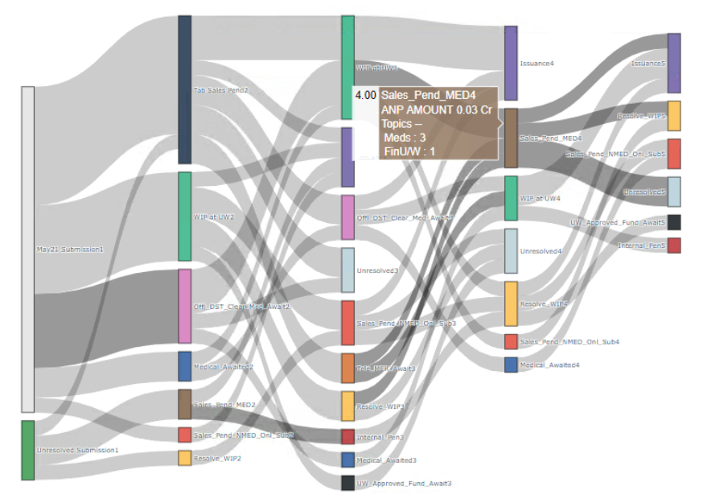

**Business Case:** The huge fallout in the customer onboarding journey was impacting the business. The objective was to <b>reduce fallout by analyzing the daily data consists of issues raised by customers and support teams as free-flowing text</b> in pending reasons data at various stages of issuance. 
<!-- ([GitHub](https://github.com/chriskhanhtran/CS224n-NLP-Solutions/tree/master/assignments/)). -->

**Solution:** For solving this I analyzed the customer onboarding journey to increase conversion using Gensim <b> LDA topic modeling</b>  on pending tickets text and developed  an <u> interactive visualization with plotly Sankey</u> . With this, Issuance increased by 6.2 % in following month. 

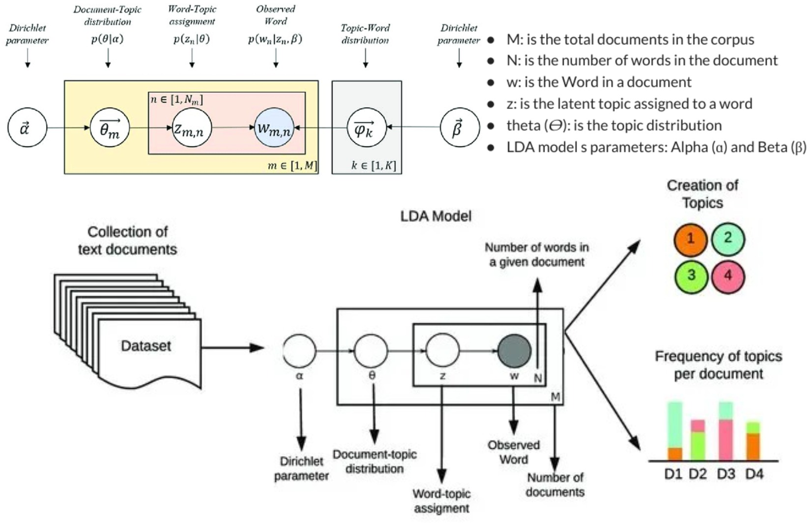

`Latent Dirichlet Allocation (LDA)` is a popular topic modeling technique to extract topics from a given corpus. The term latent conveys something that exists but is not yet developed. In other words, latent means hidden or concealed.
Finally gives the probability distribution of topics within each document and word distribution in topics.

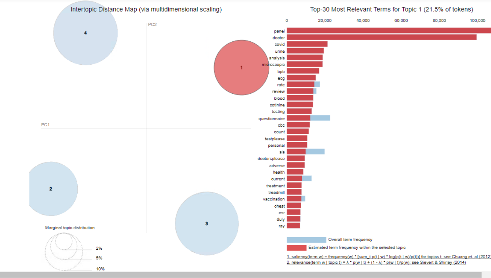

---
### ROUTE OPTIMISATION & LEAD ALLOCATION APP

<!-- 
 -->

**Business Case:**Lead allocation was not effective as a Round Robin allocation was in practice which considered neither the location nor the availability of the agents as well as customers leading to dissatisfaction at both ends.

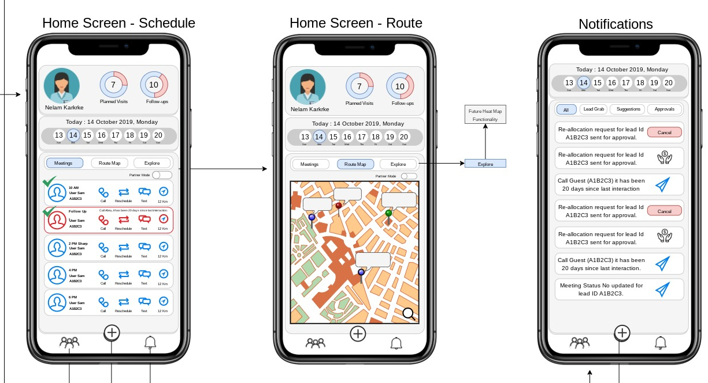

**Solution:** <b>Designed and develop the serverless backend architecture on AWS </b> using Lambda, DMS, Dynamodb, Step Function, ECR, ECS, S3, etc. Setup an <b>ETL pipeline with DMS</b> to keep it in sync with legacy systems (on-prem oracle DBS)

For scheduling meetings and reducing travel, I developed a `capacitated TSP solver with time window constraints using Google OR-tools`, along with osrm backend for <u>time-distance complexity (to compute adjacency matrix)</u>. Both of them were deployed as a `docker container as a service` using ECS, ECR and Fargate.

The availability of the customers was fetched using the app and the availability of the agents was taken from SAP HRM. There were two types of run scheduled allocation and real-time allocation. For this, I used lambdas and step functions. 

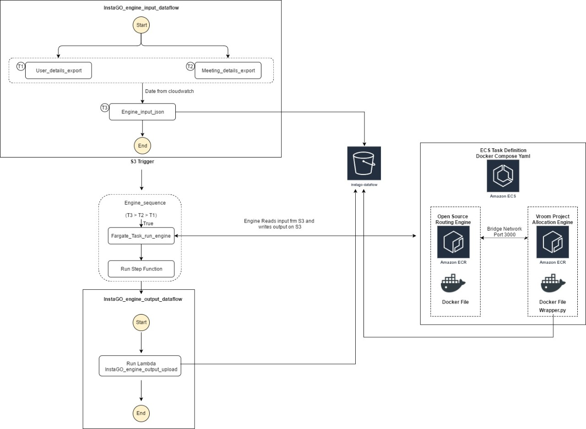

---

### Virtual Customer onboarding with Face Recognition

Developed a <b>Face recognition system to reduce fraud in virtual customer onboarding</b> with a face-matching algorithm that compared faces of customers from the frames of mandatory video with their KYC documents submitted at the time of application.

• Face matching uses <u>face embeddings from DeepFace (Facebook) model</u> with the help of haar cascade, dlib and OpenCV.
• Trained a <b>CNN model for anti-spoofing</b> and deployed the model as a service using `Docker` and `ECS` on the `serverless backend on AWS`.
 

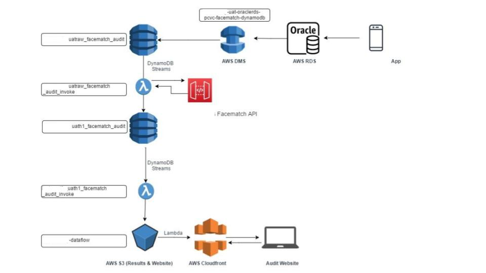

 

---
## Hackathons

### Share-2-Secure Winner <b>Microsoft Azure</b> Hack

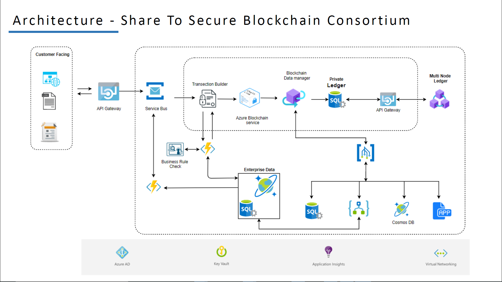

Share to Secure Application for Blockchain-Enabled Insurance on Azure Blockchain Workbench. 
Features 
• Shared view of truth 
• Programmable transfers 
• Transparency for relevant institutions 

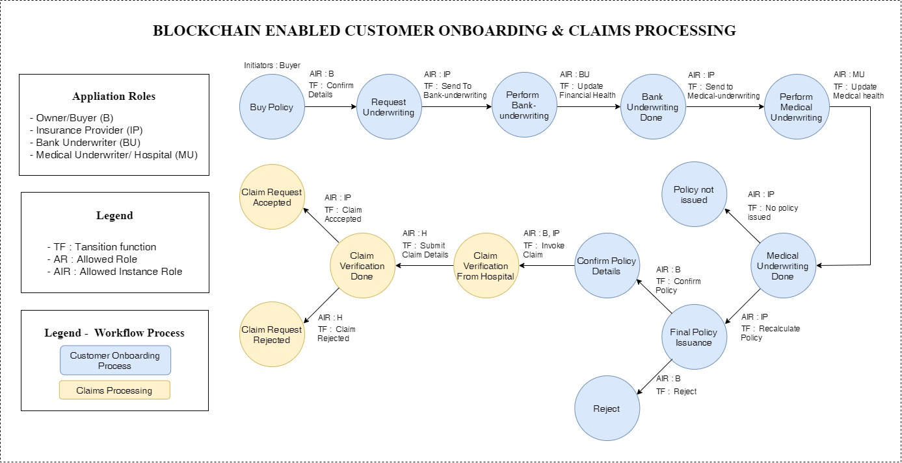

 

---
### Meraki - 1st Runner's Up in MishMash Hack 

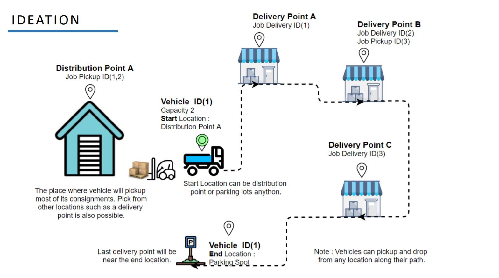

Fast Route Planning & `Route Optimisation` with the help of traveling salesman problem (TSP) algorithm.

 

 

---
## Open Source

### PyraDox

PyraDox is a simple tool which helps in document digitization by extracting text information and masking of personal information with the help of Tesseract-ocr.

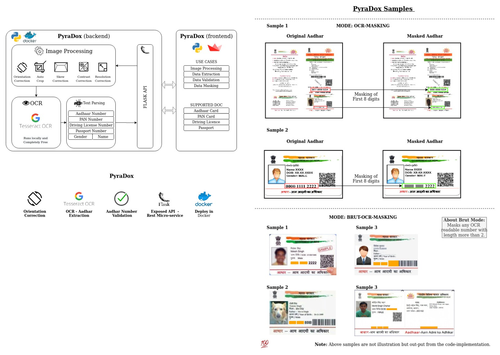

 
---

© 2021 kshitija surange. Powered by Jekyll and the Minimal Theme.

